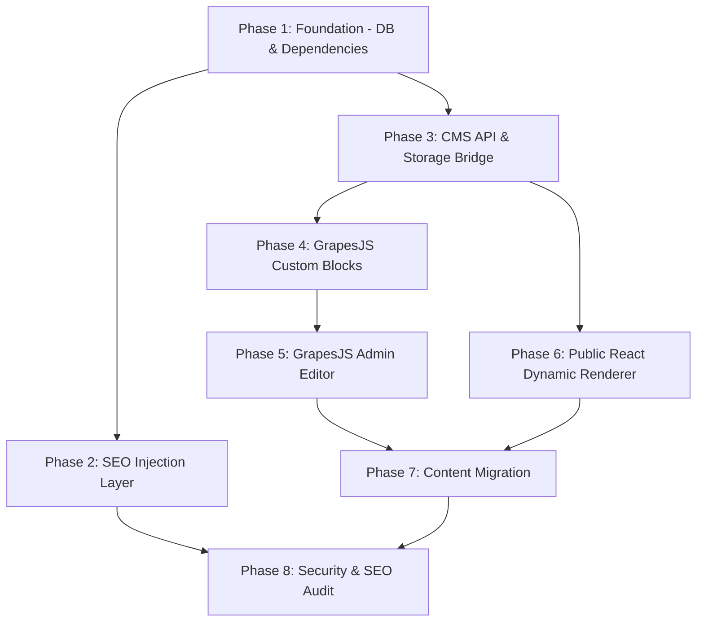

# Implementation Plan: GrapesJS Visual CMS & SEO System

**Task Complexity:** Complex

## 1. Plan Overview
This plan outlines the transformation of the NKHB website into a dynamic, GrapesJS-powered CMS with integrated SEO management. It involves database schema updates, GrapesJS integration in the admin panel, a dynamic React renderer on the public site, and automated SEO tag injection.

- **Total Phases:** 8
- **Agents Involved:** `database_administrator`, `devops_engineer`, `coder`, `seo_specialist`, `i18n_specialist`, `security_engineer`
- **Estimated Effort:** High

## 2. Dependency Graph

## 3. Execution Strategy
| Stage | Phase | Agent | Mode |
|-------|-------|-------|------|
| Foundation | 1 | `database_administrator`, `devops_engineer` | Sequential |
| Core | 2, 3 | `seo_specialist`, `coder` | Parallel |
| Blocks | 4 | `coder` | Sequential |
| Integration | 5, 6 | `coder` | Parallel |
| Migration | 7 | `i18n_specialist`, `coder` | Sequential |
| Quality | 8 | `security_engineer`, `seo_specialist` | Parallel |

## 4. Phase Details

### Phase 1: Foundation - DB & Dependencies
- **Objective:** Set up the database schema and install required libraries.
- **Agent:** `database_administrator` (DB), `devops_engineer` (Dependencies)
- **Files to Create:**
  - `supabase/migrations/20260512_cms_tables.sql`: Create `cms_pages` table.
- **Files to Modify:**
  - `package.json`: Add `grapesjs`, `react-helmet-async`, `dompurify`, `@types/dompurify`.
- **Validation:** `npm install` and check Supabase table via dashboard.

### Phase 2: SEO Injection Layer
- **Objective:** Implement dynamic meta tag injection using React Helmet.
- **Agent:** `seo_specialist`
- **Files to Create:**
  - `src/public/components/SEO.tsx`: Wrapper for React Helmet.
- **Files to Modify:**
  - `src/public/App.tsx`: Wrap with `HelmetProvider` and integrate `SEO` component.
- **Validation:** Inspect browser head tags after navigation.

### Phase 3: CMS API & Storage Bridge
- **Objective:** Create the service layer for saving/loading GrapesJS JSON and SEO data.
- **Agent:** `coder`
- **Files to Create:**
  - `src/admin/lib/cms.ts`: Supabase wrapper for `cms_pages` CRUD.
- **Validation:** Test CRUD functions with dummy JSON data.

### Phase 4: GrapesJS Custom Blocks
- **Objective:** Define GrapesJS blocks that correspond to NKHB React components.
- **Agent:** `coder`
- **Files to Create:**
  - `src/admin/components/GrapesEditor/blocks.ts`: Block definitions for Hero, Background, etc.
- **Validation:** Unit tests for block attribute mapping.

### Phase 5: GrapesJS Admin Editor
- **Objective:** Build the visual editor interface in the admin panel.
- **Agent:** `coder`
- **Files to Create:**
  - `src/admin/pages/Pages.tsx`: The main GrapesJS editor route.
  - `src/admin/components/GrapesEditor/Editor.tsx`: GrapesJS initialization logic.
- **Files to Modify:**
  - `src/admin/App.tsx`: Add route for `/pages`.
- **Validation:** Manually verify drag-and-drop in the admin panel.

### Phase 6: Public React Dynamic Renderer
- **Objective:** Refactor the public site to render components from GrapesJS JSON.
- **Agent:** `coder`
- **Files to Modify:**
  - `src/public/pages/Home.tsx`: Change to fetch layout from Supabase and render dynamically.
- **Validation:** Verify public site renders correctly with a saved layout.

### Phase 7: Content Migration
- **Objective:** Seed the initial `cms_pages` data from `i18n.tsx`.
- **Agent:** `i18n_specialist`
- **Files to Create:**
  - `scripts/migrate_i18n_to_cms.js`: One-time script to convert `i18n.tsx` values into JSON blocks.
- **Validation:** Verify that the default page is identical to the current static version.

### Phase 8: Security & SEO Audit
- **Objective:** Final verification of sanitization and search engine readiness.
- **Agent:** `security_engineer` (Sanitization), `seo_specialist` (SEO Check)
- **Validation:** Run automated security scan and verify meta tags for all routes.

## 5. Risk Classification
| Phase | Risk | Rationale |
|-------|------|-----------|
| 1 | Low | Standard DB/Dependency setup. |
| 4 | Medium | Complex mapping between GrapesJS and React props. |
| 6 | High | High risk of breaking the main page if JSON structure deviates. |
| 8 | Low | Post-implementation verification. |

## 6. Execution Profile
- Total phases: 8
- Parallelizable phases: 6 (in 3 batches)
- Sequential-only phases: 2
- Estimated parallel wall time: ~4-6 development turns.
